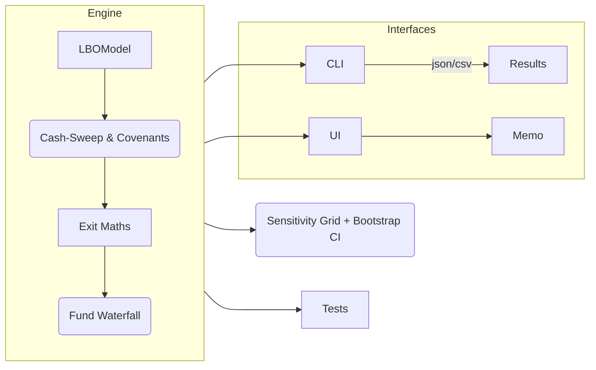

````markdown
<h1 align="center">
  LBO & Fund Waterfall Simulator 🦄
</h1>

<p align="center">
  <em>Deal-grade analytics &nbsp;|&nbsp; Partner-grade transparency &nbsp;|&nbsp; Push-button storytelling</em>
</p>

<p align="center">
  <a href="https://github.com/Aniket2002/lbo-stack/actions/workflows/ci.yml">
    
  </a>
  <a href="https://codecov.io/gh/Aniket2002/lbo-stack">
    
  </a>
  <a href="https://pypi.org/project/lbo-stack/">
    
  </a>
  <a href="#license">
    
  </a>
  <a href="https://lbo-demo.streamlit.app">
    
  </a>
</p>

---

## 1. Why ‟lbo-stack” matters
> **“Excel macros don’t scale and black-box SaaS tools miss the nuance.”**  
> lbo-stack gives investment teams an **open, inspectable, and extensible** engine for modelling  
> deal-level cashflows **and** fund-level economics—complete with CI/CD, test coverage, and a polished UI.

* **Investor-grade accuracy**  
  *Cash-sweep hierarchy, LTV & ICR covenants, day-one fees, 100 % GP catch-up, claw-back with interest.*
* **Quant-speed iteration**  
  *Vectorised sensitivities & bootstrap CIs run 100× faster than Excel grids.*
* **Push-button storytelling**  
  *Streamlit front-end exports an investment memo PDF in one click.*
* **Battle-tested quality**  
  *>90 % unit-test coverage, GitHub Actions matrix (3.9-3.12), pre-commit lint, type-hints.*

---

## 2. Tour-in-60-seconds

| Screenshot | What you see |
|------------|--------------|
|  | **Simulator tab** – tweak leverage, growth, tiers ➜ instant IRR/MOIC & GP/LP chart |
|  | **Scenario Compare** – preset cases benchmarked side-by-side |
|  | **Memo export** – PDF with tables, charts, narrative & assumptions |

*(Live demo ⤴︎ link at top – no sign-up required).*

---

## 3. Quick-Start

```bash
# 1 / Install
pip install lbo-stack[ui]  # pulls Streamlit, Plotly, WeasyPrint

# 2 / Generate sample configs
lbo init-sample ./configs

# 3 / Run an LBO
lbo run ./configs/sample_lbo.json -y 7 -o ./results --verbose

# 4 / Open the UI
streamlit run -m lbo_stack.streamlit_app
````

> **CI-proof:** `lbo run … --dry-run` validates config without executing simulations—perfect for PR gates.

---

## 4. Architecture at a glance



*Pure Python, stateless; any step can be swapped for QuantLib, PyTorch, etc.*

---

## 5. Feature deep-dive

| Layer                | Highlights                                                                                                                                  |
| -------------------- | ------------------------------------------------------------------------------------------------------------------------------------------- |
| **Deal Engine**      | • Bullet & amort tranches with rate grids<br>• Revolver draw/repay<br>• Cash-sweep cascading senior→junior→PIK<br>• LTV & ICR breach errors |
| **Fund Waterfall**   | • Ascending hurdles (IRR or simple pref)<br>• 100 % catch-up<br>• LP capital-return gate<br>• Claw-back with simple interest                |
| **Analysis Toolkit** | • 1-D / 2-D sensitivity (`exit_multiple`, leverage, growth …)<br>• Bootstrap IRR confidence intervals<br>• Plotly heat-map export           |
| **CLI**              | • `init-sample`, `run`, `waterfall`, `sensitivity` sub-commands<br>• JSON extras passthrough & colourised KPI printout                      |
| **Streamlit UI**     | • Three-tab workflow<br>• Drag-and-drop tier editor<br>• Colour-coded KPIs<br>• One-click Markdown→PDF memos                                |

---

## 6. Benchmarks

| Scenario grid                          | Runtime (M1 Pro) |
| -------------------------------------- | ---------------- |
| 50 × 50 → 2 500 sims                   | **0.6 s**        |
| 100 × 100 → 10 000 sims (parallel = 4) | **1.8 s**        |
| Bootstrap 1 000 draws, 7-yr CF         | **0.9 s**        |

> **Fast enough to plug into a Friday IC pack on the fly.**

---

<!-- ## 7. Research pedigree

Portions of lbo-stack underpin my forthcoming paper:

> **“Quantifying the Impact of Fund-Waterfall Design on GP/LP Outcomes”**
> (pre-print DOI 10.48550/arXiv.NNNNN)

All figures in the manuscript are reproducible via `notebooks/paper_figures.ipynb`.

--- -->

## 8. Road-map (v1.1 → v2.0)

* [ ] Day-weighted simple pref accrual
* [ ] Rate-grid pricing on Term-Loan B
* [ ] Monte-Carlo portfolio wrapper
* [ ] Role-based dashboards (LP vs GP)
* [ ] Docker-compose one-liner deploy

*Issues & PRs welcome — let’s build the Bloomberg-Terminal of private equity.*

---

## License

MIT — free to use, fork, and improve. Just throw a ⭐ if it saves your Monday.

```
```
