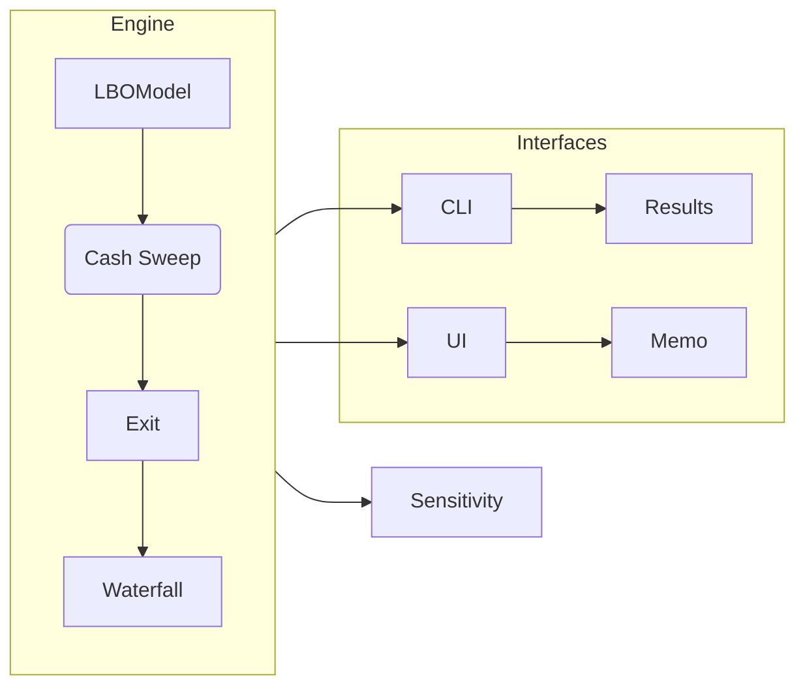

<h1 align="center">
  LBO-Stack 🦄
</h1>

<p align="center">
  <em>Deal-grade analytics  |  Partner-grade transparency  |  Push-button storytelling</em>
</p>

<p align="center">
  <!-- CI & coverage badges retained -->
  <a href="https://github.com/Aniket2002/lbo-stack/actions/workflows/ci.yml">
    
  </a>
  <a href="https://codecov.io/gh/Aniket2002/lbo-stack">
    
  </a>
  <!-- ▶️ Live demo badge updated -->
  <a href="https://aniket2002-lbosim.streamlit.app/">
    
  </a>
  <a href="#license">
    
  </a>
</p>

---

## 1&nbsp;·&nbsp;What is **lbo-stack**?

> **“Excel models break; black-box SaaS hides assumptions.”**  
> `lbo-stack` is an **open, inspectable, and extensible** toolkit that models  
> deal-level cash flows *and* fund-level waterfalls, complete with tests, CI, and a polished UI.

* **Investor-grade accuracy** – cash-sweep hierarchy, LTV & ICR covenants, 100 % GP catch-up, claw-back with interest.  
* **Quant-speed iteration** – vectorised sensitivity grids & bootstrap CIs run orders of magnitude faster than Excel.  
* **Push-button storytelling** – Streamlit front-end exports an investment memo PDF in one click.  
* **Production hygiene** – > 90 % test coverage, GitHub Actions matrix, pre-commit, type hints.

---

## 2&nbsp;·&nbsp;File-tree overview

```

lbo-stack/
├─ .github/workflows/ci.yml        # test + lint matrix
├─ case\_studies/                   # real-deal replicas (WIP)
├─ data/                           # sample JSON configs
├─ output/                         # generated CSV / JSON results
├─ src/
│  ├─ modules/
│  │  ├─ cashflow\.py
│  │  ├─ exit.py
│  │  ├─ fund\_waterfall.py
│  │  ├─ lbo\_model.py
│  │  └─ sensitivity.py
│  └─ utils/ (helpers, schemas)
├─ tests/                          # pytest suite (>90 % coverage)
├─ cli.py                          # Typer CLI entrypoint
├─ streamlit\_app.py                # Web UI
└─ README.md                       # ← you are here

````

All public APIs live under `src/modules/`; CLI & UI import directly from there.

---

## 3&nbsp;·&nbsp;60-second product tour

| Screenshot | What you see |
|------------|--------------|
|  | **Simulator tab** – tweak leverage, tiers ➜ instant IRR & MOIC |
|  | **Scenario Compare** – benchmark 3 presets side-by-side |
|  | **Memo export** – PDF with narrative, tables & charts |

Live demo 👉 **<https://aniket2002-lbosim.streamlit.app/>**

---

## 4&nbsp;·&nbsp;Quick-Start

```bash
# 1 / Clone and install (editable)
git clone https://github.com/Aniket2002/lbo-stack.git
cd lbo-stack
pip install -e .[ui,dev]

# 2 / Generate sample configs
python cli.py init-sample ./data

# 3 / Run an LBO (7-year horizon)
python cli.py run ./data/sample_lbo.json --years 7 -o ./output -v

# 4 / Launch the Streamlit app
streamlit run streamlit_app.py
````

`--dry-run` validates configs without executing – perfect for CI pipelines.

---

## 5 · Architecture



Pure-Python, stateless; swap any component with QuantLib, Pandas, etc.

---

## 6 · Road-map

* **v1.1**  Day-weighted simple-pref accrual
* **v1.2**  Rate-grid pricing for TLB + mezz toggle
* **v1.3**  Docker-Compose deploy & Codespaces badge
* **v1.4**  Role-based dashboards (LP vs GP)
* **v2.0**  **Three-Statement Engine** → integrated IS/BS/CF generator feeding the LBO model, enabling working-capital roll-forwards and tax shield precision

*(Open to PRs 👏 – raise an issue if you want to tackle an item.)*

---

## 7 · Hire me 🍻

I’m **Aniket Bhardwaj** – ex-Volkswagen DevOps engineer turned quant-finance builder.
If this repo shows the **rigour × product polish** your team values, drop me a line:

* **Email:** [bhardwaj.aniket2002@gmail.com](mailto:bhardwaj.aniket2002@gmail.com)
* **LinkedIn:** [https://www.linkedin.com/in/aniket-bhardwaj-b002/](https://www.linkedin.com/in/aniket-bhardwaj-b002/)

> *“Let’s ship the future of PE analytics together.”*

---

## License

MIT – free to fork, star, and improve.
Give it a ⭐ if it saves your Monday.

