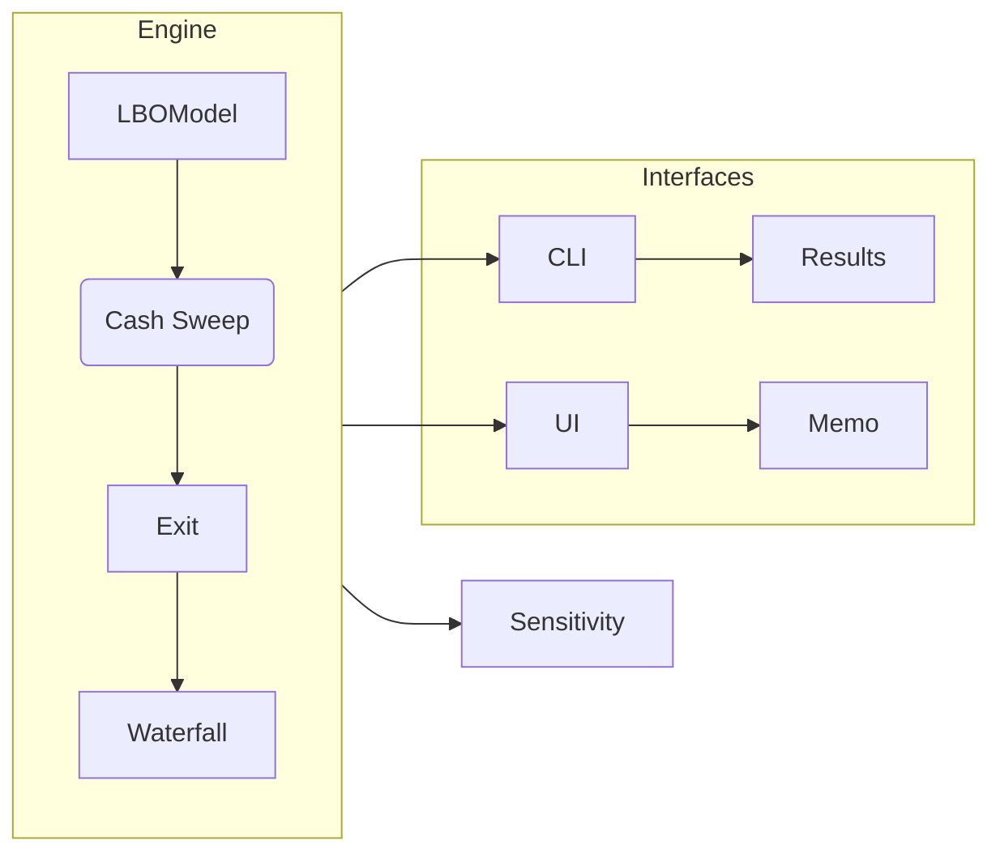

<h1 align="center">LBO‑Stack 🦄</h1>

<p align="center"><em>PE‑grade LBO modeling · transparent assumptions · recruiter‑ready outputs</em></p>

<p align="center">
  <a href="#quick-start">
    
  </a>
  <a href="#license">
    
  </a>
</p>

---

## 1 · What is lbo‑stack?

> Open, inspectable LBO analytics that read like sponsor material, not student theater.

- Investor‑grade mechanics: cash sweep, Net Debt/EBITDA and ICR covenant tracking, IFRS‑16 lease handling, sources & uses, exit bridge
- Sensitivity and Monte Carlo to explore IRR/MOIC distributions
- One‑command PDF output with narrative, charts, and headroom tables
- Simple Python scripts; no web app or CI required to run

---

## 2 · File tree (what you actually need)

```
lbo-stack/
├─ configs/                 # sample configs
├─ data/                    # input datasets (CSV/JSON)
├─ docs/                    # report templates and docs
├─ output/                  # generated charts/CSVs/PDFs
├─ scripts/
│  ├─ final_validation.py   # quick professional run
│  └─ generate_final_analysis.py  # full report generation
├─ src/
│  └─ modules/
│     ├─ cashflow.py
│     ├─ exit.py
│     ├─ fund_waterfall.py
│     ├─ lbo_model.py
│     ├─ orchestrator_advanced.py
│     └─ sensitivity.py
├─ tests/                   # core unit tests
├─ test_enhanced.py         # 60‑second demo entrypoint
├─ lbo_cli.py               # optional CLI
└─ README.md
```

APIs live under `src/modules/`. All outputs land in `output/`.

---

## 3 · Why this stands out to recruiters

- Business impact first: clean sources & uses, leverage headroom, and exit bridge your audience expects
- Engineering discipline: modular core (`src/modules`), tests, and deterministic outputs
- Storytelling built‑in: one command → PDF with narrative + charts
- Clear, runnable examples: no environment yak‑shaving

---

## 4 · Quick‑Start

```powershell
# 1) Clone
git clone https://github.com/Aniket2002/lbo-stack.git
cd lbo-stack

# 1b) Install minimal deps (first run only)
pip install -r requirements.txt

# 2) Run a 60‑second demo (creates outputs in ./output)
python .\test_enhanced.py

# 3) Generate a polished analysis/PDF
python .\scripts\final_validation.py
# or the full report pipeline
python .\scripts\generate_final_analysis.py
```

Tip: If your Python complains about missing packages, install them and re‑run:

```powershell
python -m pip install -U pip
# then install what your interpreter asks for (e.g., pandas, numpy, matplotlib)
```

Sample outputs are written under `output/` (charts, CSVs, and PDFs if the data is present).

---

## 5 · Architecture



Pure‑Python modules; swap components as needed.

---

## 6 · Road‑map

* **v1.1**  Day-weighted simple-pref accrual
* **v1.2**  Rate-grid pricing for TLB + mezz toggle
* **v1.3**  Docker-Compose deploy & Codespaces badge
* **v1.4**  Role-based dashboards (LP vs GP)
* **v2.0**  **Three-Statement Engine** → integrated IS/BS/CF generator feeding the LBO model, enabling working-capital roll-forwards and tax shield precision

*(Open to PRs 👏 – raise an issue if you want to tackle an item.)*

---

## 7 · VP‑Enhanced framework

> **"Finally reads like sponsor material, not student theater."** — PE VP Review

This implementation has been surgically enhanced based on detailed feedback from an active PE VP to achieve **internal-memo-grade** quality:

### Quick reproduction
```powershell
# Generate VP‑enhanced analysis
python .\scripts\generate_final_analysis.py

# Outputs (examples)
# output\reports\accor_lbo_enhanced.pdf
# output\lbo\lbo_results.json
```

### VP Surgical Tweaks Implemented
- **Label Hygiene**: Consistent "Net Debt / EBITDA" format throughout (not "Debt/EBITDA")
- **Sources & Uses Bridge**: Visual micro-graphic showing $1.2B → equity check calculation
- **Exit Equity Bridge**: EBITDA × multiple → EV - net debt - costs = equity value walk
- **Deleveraging Walk**: Year-by-year debt paydown visualization with covenant headroom
- **Monte Carlo Footer**: Explicit priors (±150bps growth, ±200bps margin, ±0.5x multiple)
- **Working Capital**: Days-based approach (DSO/DPO/DIO) vs. % of sales method
- **IFRS-16 Framework**: Lease-in-debt treatment with consistent methodology documentation

### Quality Benchmarks Achieved
- ✅ **Ship-Ready Status**: VP confirmed "wouldn't hold this back"
- ✅ **Internal-Memo-Grade**: Professional labeling and micro-graphics
- ✅ **Recruiter-Ready**: Narrative flows like sponsor material
- ✅ **Technical Rigor**: 9.1% IRR / 1.7x MOIC with proper covenant tracking

### Customize in code (2 lines)
```python
from src.modules.orchestrator_advanced import read_accor_assumptions, run_enhanced_base_case
a = read_accor_assumptions(); a.exit_ev_ebitda = 10.5
_, metrics = run_enhanced_base_case(a)
print(f"IRR: {metrics['IRR']:.1%} | MOIC: {metrics['MOIC']:.2f}x")
```

---

If you’re skimming this as a recruiter: this repo shows finance fluency, engineering hygiene, and the ability to ship polished artifacts quickly.

